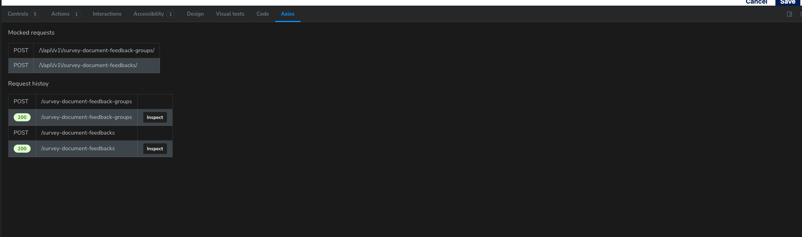

import {Meta} from "@storybook/addon-docs/blocks";

<Meta title="storybook-axios/readme"/>

# storybook-axios

Storybook addon to inspect Axios network requests. It lets you:
- See outgoing requests and incoming responses in Storybook’s UI
- Inspect errors
- Configure request mocks (via axios-mock-adapter) per story




## Overview
- Package name: `storybook-axios`
- Entry points (ESM exports):
  - `storybook-axios/manager` — registers the add-on (adds a panel to Storybook)
  - `storybook-axios/decorator` — provides the `withStorybookAxios(axios, opts?)` decorator
- Works with Storybook 9 (React, Vue, Angular) and Axios v1
- No runtime env vars required


## Requirements
- Node.js: 22 (see `package.json#engines`)
- Peer dependencies (install in your Storybook project):
  - `axios@^1.12.2`
  - `react@>=18` and `react-dom@>=18` (for React-based Storybook projects)
  - `storybook@^9.1.16`

Note: The add-on UI is shown in the Storybook Manager; your stories can be React, Vue, or Angular. The decorator attaches Axios interceptors to the Axios instance you pass in.


## Installation
Install in your Storybook project (not in this repo, unless you are developing the add-on):

```bash
npm install storybook-axios
# or
pnpm add storybook-axios
# or
yarn add storybook-axios
```


## Setup in Storybook
1) Enable the add-on in your `.storybook/main.ts` (or `main.js`):

```ts
// .storybook/main.ts
export default {
  addons: [
    // ...other addons
    'storybook-axios/manager',
  ],
};
```

2) Register the decorator in `.storybook/preview.ts` (or `preview.js`) and pass your app’s Axios instance:

```ts
// .storybook/preview.ts
import type { Preview } from '@storybook/react'; // or framework package you use
import { withStorybookAxios } from 'storybook-axios/decorator';
import { axios } from '../src/axios'; // <- your app’s singleton Axios instance

export const decorators: Preview['decorators'] = [
  withStorybookAxios(axios),
];

export const parameters: Preview['parameters'] = {
  actions: { argTypesRegex: '^on[A-Z].*' },
};
```

Tip: Use a single, shared Axios instance across your app so the decorator can attach interceptors consistently.


## Mocking requests per story
You can configure mocks with `axios-mock-adapter` on a per-story basis using Storybook `parameters.axios`.

```tsx
// Button.stories.tsx (React example)
import type { Meta, StoryObj } from '@storybook/react';
import { withStorybookAxios } from 'storybook-axios/decorator';
import { axios } from '../src/axios';
import Button from './Button';

const meta: Meta<typeof Button> = {
  title: 'Components/Button',
  component: Button,
  decorators: [withStorybookAxios(axios)],
  parameters: {
    axios: {
      mock: (mock) => {
        mock
          .onPost(/\/api\/v1\/survey-document-feedback-groups/)
          .reply(200, { data: { /* ... */ } });

        mock
          .onPost(/\/api\/v1\/survey-document-feedbacks/)
          .reply(200, { data: { /* ... */ } });
      },
      // catchAll: true,
      // passThrough: true,
    },
  },
};
export default meta;

type Story = StoryObj<typeof Button>;
export const Default: Story = {};
```

### Parameters
Type definition (from the decorator):
```ts
export type StorybookAxiosOpts = {
  mock?: (adapter: AxiosMockAdapter) => void;
  catchAll?: boolean;
  passThrough?: boolean;
};
```
- mock: Configure handlers on the provided `AxiosMockAdapter`.
- catchAll: If true, respond with 501 for any request that doesn’t match a handler.
- passThrough: If true, allow unmatched requests to pass through (hit the real network).

For detailed mocking options, see axios-mock-adapter: https://www.npmjs.com/package/axios-mock-adapter


## How it works
- The decorator attaches Axios request/response interceptors and emits Storybook events captured by the add-on panel.
- When `parameters.axios.mock` is provided, the add-on constructs an `AxiosMockAdapter` using your story’s Axios instance and shows a list of mocked routes in the UI.


## Scripts (for developing this repository)
Available in this repo’s `package.json`:
- `npm run lint` — Lint `./src`
- `npm run format` — Lint and fix `./src`
- `npm run typecheck` — TypeScript check without emitting
- `npm run build` — Build TypeScript
- `npm run dev` — Build in watch mode
- `npm run storybook` — Run example Storybook locally on port 6006
- `npm run build-storybook` — Build the Storybook static site

Package manager: npm (lockfile present). Vite is used as the Storybook builder in this repo’s example configuration.


## Project structure (repo)
- `src/` — Add-on source (decorator, manager UI, components)
- `stories/` — Example stories for local development
- `doc/` — Images and docs assets (e.g., `ui.png`)
- `utils/` — Internal utilities
- `vite.storybook.config.js` — Vite builder configuration for Storybook
- `eslint.config.js`, `tsconfig.json` — Linting and TypeScript config
- `.github/workflows/check-pull-request.yml` — CI checks


## Environment variables
- None required by the add-on at runtime.
- TODO: Document any future env vars if introduced.


## Tests
- No test suite is currently defined in `package.json`.
- TODO: Add tests (unit for utilities/components, and integration with Storybook if feasible).


## License
- ISC (see `package.json#license`).
- TODO: Add a `LICENSE` file to the repo if you need the full text checked into source control.


## Changelog / Migration
- If you used earlier versions that imported a default decorator from `storybook-axios`, switch to the named export from `storybook-axios/decorator`:
  - Before: `import withAxiosDecorator from 'storybook-axios'`
  - Now: `import { withStorybookAxios } from 'storybook-axios/decorator'`


## Support
Issues and feature requests: https://github.com/faebeee/storybook-axios/issues

